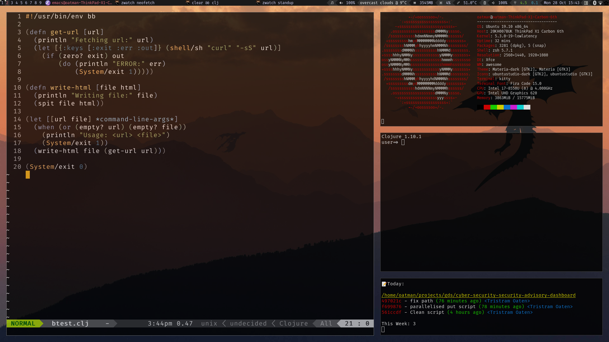

## OS Customization

---

## Desktop Environment

- Display Manager
- Window Manager
- Compositor
- Applets
- Clipboard manager
- Notifications
- Launcher
- Screen locker

---

## Window Managers

- Tiling
- Stacking

---

## i3wm

- Unix philosophy
- Pre-configured distributions:
  - Manjaro i3
  - Arco Linux

---

## Terminal Emulator

> [Alacritty](https://github.com/jwilm/alacritty/releases/download/v0.3.3/Alacritty-v0.3.3-ubuntu_18_04_amd64.deb)

---

## UI Config

- GTK: lxappearance
- QT: qt5ct

---

## Notifications

- Let's install dunst
- [Other options](https://wiki.archlinux.org/index.php/Desktop_notifications)

---

## Screen locker

- i3lock
- i3lock-color
- betterlockscreen
- xautolock

---

## Wallpaper

- nitrogen
- feh

---

## TMUX

- Terminal multiplexer
- Tile/tab terminals
- Alternative: GNU Screen

---

## Shells

- sh
- bash
- zsh
- fish

---

## zsh plugins

- oh-my-zsh
  - Synchronous (slow)
  - antigen
  - antibody
  - zplugin
- zsh-autosuggestions
- fzf
- ssh-agent
- git
- pure-promt

---

# Script your setup!
